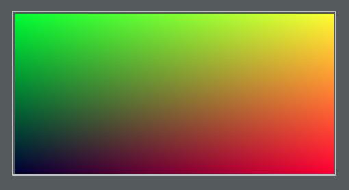
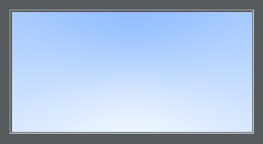
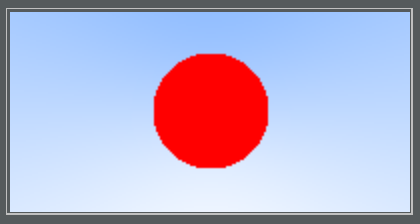
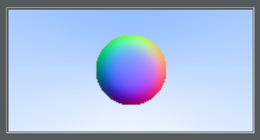

# Write A Raytracer in One Weekend.
Attempting to follow https://github.com/petershirley/raytracinginoneweekend

Step 1: Create a PPM file

Step 2: Render a "Linear Blend" or "Linear Interpolation"

Step 3: Render a Sphere

Step 4: Surface Normals

