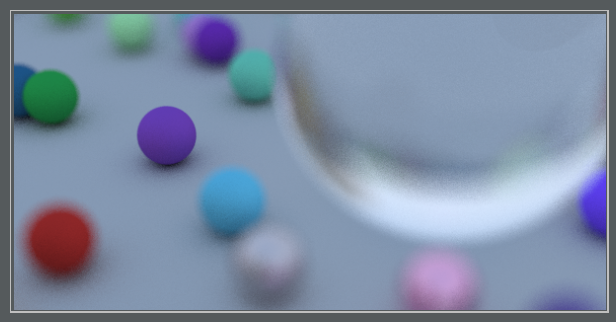

# Write A Raytracer in One Weekend.
Attempting to follow https://github.com/petershirley/raytracinginoneweekend

Rust related notes: 
- The https://doc.rust-lang.org/book/second-edition is great (ch. 1 - 12 so far...)
- Structs are pretty powerful, but I'm not 100% sure if my use of new() is correct.  I'm sort of inconsistently using
 it as a way to instantiate a new object like I would an \__init\__ Python -- but its clearly doing something else. 
 It is being used as more of a factory to produce an object rather than init it.
- Structs, impl, and traits feel good -- and work well for me -- but at the same time I'm left confused as to how to
have a struct/fn actually accept multiple objects that share a trait.  The Lambert and Metal material are actually the
quite similar other than its implimentation of its material trait -- but I can't feed a generic material::Material as a 
param.  I'm missing something that I'm hoping I'll find out about in a future chapter -- looks like Box keyword might be 
my solution?  But its confusing.
- I really enjoy the fast iteration of the compiler giving warnings and helpful indications of what is going wrong.  I 
seem to encounter the same things over and over -- so I have a feeling once things click in a bit more that I'll actually
have learned something from this excercise beyond just learning Rust, but also how references really should be used.
- I used PyCharm and IntelliJ's Rust plugin (both commercial and community versions seemed the same) - and its awesome
except for the fact that there is no breakpoints or way to profile (that I could see).
- I've had one work colleague take a look at the work and did note that it looked very C like in structure instead of 
Rust like -- This is due to the handholding of the tutorial, and I'm hoping to to revisit and better understand where 
I'm writing non-Rust like code :).   This is really about me not asking for outside reviews enough... so will fix that.
- Some additional resources that were helpful:
--> https://joshleeb.com/posts/rust-traits-and-trait-objects/
--> https://stackoverflow.com/questions/30353462/how-to-clone-a-struct-storing-a-boxed-trait-object

Step 1: Create a PPM file

Step 2: Render a "Linear Blend" or "Linear Interpolation"

Step 3: Render a Sphere

Step 4: Surface Normals

Step 5: Adding Multiple 'Hitables' to the 'world'

Step 6: Antialiasing

Step 7: Diffuse Materials (uncorrected/gamma corrected)

Removed 'Shadow Acne':

Step 8/9: Adding a Lambert, Metal (with then without fuzz parameter), and Dielectric Materials

Step 10: Updated the camera controls

Step 11: Added DOF

